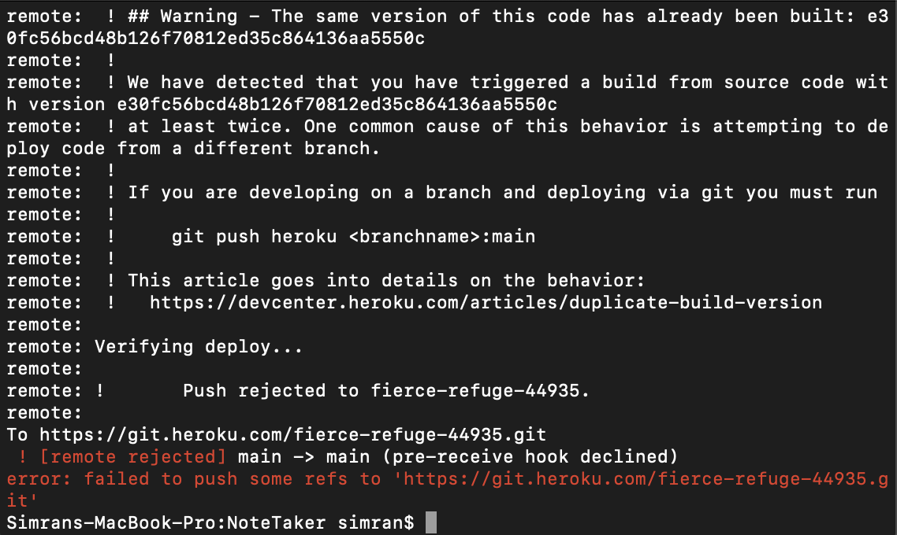

# NoteTaker

In this assignment we were supposed to connect our separate files using require and express. We were also supposed to create data and get, post, and delete this data. 

I could not get my application to work with heroku this is the error that I was getting. 
